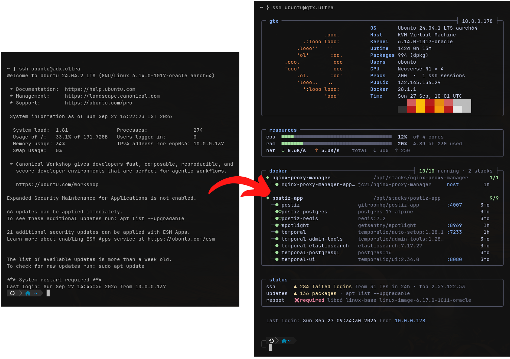

# awesome-ssh-login-screen

A fastfetch / btop-style **SSH login screen** for Linux servers — your distro's logo, system info, live CPU/RAM/network, Docker stacks and security status, shown every time you SSH in.

Works on Ubuntu, Debian, Fedora, RHEL / Rocky / Alma / Oracle, Amazon Linux, Arch, openSUSE, Alpine and [~200 other distros](logos.txt).

<p align="center">
  
  <br><sub>Stock Ubuntu login (left) → awesome-ssh-login-screen (right)</sub>
</p>

<details>
<summary>Plain-text preview</summary>

```
╭─ web ─────────────────────────────────────────────────────────┤ 10.0.0.12 ├──╮
│                                   OS       Ubuntu 24.04.1 LTS aarch64        │
│                    .ooo.          Host     KVM Virtual Machine               │
│             .:looo looo:          Kernel   6.14.0-1017-oracle                │
│           .looo''   ''            Uptime   142d 0h 2m                        │
│           'ol'       :oo.         Packages 994 (dpkg)                        │
│       .ooo.           ooo         Users    deploy                            │
│       'ooo'           ooo         CPU      Neoverse-N1 × 4                   │
│           .ol.       :oo'         Procs    326  ·  2 ssh sessions            │
│           'looo..   ..            Public   203.0.113.24                      │
│             ':looo looo:          Docker   28.1.1                            │
│                    'ooo'          Time     Sun 27 Sep, 09:48 UTC             │
│                                           ████████████████████████           │
│                                           ████████████████████████           │
╰──────────────────────────────────────────────────────────────────────────────╯

╭─ resources ──────────────────────────────────────────────────────────────────╮
│ cpu  ■■■■■■■■■■■■■■■■■■■■■■■■■■■■■■■■■■■■  15%  of 4 cores                   │
│ ram  ■■■■■■■■■■■■■■■■■■■■■■■■■■■■■■■■■■■■  21%  4.9G of 23G used             │
│ net  ↓ 2.6K/s   ↑ 2.8K/s    total  ↓ 30G  ↑ 25G                              │
╰──────────────────────────────────────────────────────────────────────────────╯

╭─ docker ─────────────────────────────────────────┤ 4/4 running · 2 stacks ├──╮
│ ◆ nginx-proxy-manager              /opt/stacks/nginx-proxy-manager       1/1 │
│  └─● nginx-proxy-manager-app… jc21/nginx-proxy-manager     host       12d    │
│                                                                              │
│ ◆ myapp                            /opt/stacks/myapp                     3/3 │
│  ├─● myapp-web                you/myapp                    :8080       3d    │
│  ├─●♥myapp-postgres           postgres:17-alpine                       3d    │
│  └─●♥myapp-redis              redis:7.2                                3d    │
╰──────────────────────────────────────────────────────────────────────────────╯

╭─ status ─────────────────────────────────────────────────────────────────────╮
│ ssh      ▲ 284 failed logins from 31 IPs in 24h · top 198.51.100.7           │
│ updates  ▲ 136 packages · apt list --upgradable                              │
│ reboot   ✖ required libc6 linux-base linux-image-6.17.0-1011-oracle          │
╰──────────────────────────────────────────────────────────────────────────────╯

  Last login: Sun Sep 27 09:30:49 2026 from 10.0.0.12
```

</details>

## Features

- **Header** — your distro's logo in its colors, with OS, host, kernel, uptime, packages, users, CPU, processes, public IP, Docker version and a two-row color palette
- **Resources** — real CPU usage and network speed (sampled over ~0.2 s), RAM, total traffic since boot
- **Docker** — containers grouped by compose project, with status dot (running / starting / unhealthy / stopped), ♥ for passing health checks, image, published ports and uptime. Hidden when Docker isn't available
- **Status** — failed SSH logins in the last 24 h (with the top offending IP), pending updates, reboot-required
- **Last login** line in the same style
- **Flicker-free & fast** — built in memory and written in a single write; ~0.3 s. Nothing blocks on the network or on slow package managers — those values are cached and refreshed in the background
- **Honest** — rows it can't determine on a system are hidden, never guessed

## Install

One command — run it as your normal user, it asks for `sudo` when needed:

```sh
curl -fsSL https://raw.githubusercontent.com/RajdeepVerma/awesome-ssh-login-screen/main/install.sh | sh
```

No curl? `wget -qO- https://raw.githubusercontent.com/RajdeepVerma/awesome-ssh-login-screen/main/install.sh | sh`

Or from a clone:

```sh
git clone https://github.com/RajdeepVerma/awesome-ssh-login-screen.git
cd awesome-ssh-login-screen && sh install.sh
```

Several servers at once:

```sh
for h in web01 web02 db01; do
  ssh -t "$h" 'curl -fsSL https://raw.githubusercontent.com/RajdeepVerma/awesome-ssh-login-screen/main/install.sh | sh'
done
```

Re-running the installer updates to the latest version. Open a new SSH session to see it.

## Supported distros

The installer picks how to hook into SSH logins:

| Mode | Used on | How it runs |
|---|---|---|
| `motd` | Debian, Ubuntu and derivatives | `pam_motd` runs `/etc/update-motd.d/01-awesome-ssh-login-screen` on every SSH login |
| `profile` | everything else (Fedora, RHEL family, Arch, openSUSE, Alpine, …) | `/etc/profile.d/zz-awesome-ssh-login-screen.sh`, once per interactive SSH login shell |

Force one with `sh install.sh --mode motd` or `--mode profile`. Profile mode works with bash, and with zsh on distros whose zsh reads `/etc/profile` (Arch, Fedora, openSUSE); it doesn't run for fish.

What each row reads, per distro:

| Row | Source |
|---|---|
| Packages | `dpkg`, `rpm`, `pacman`, `apk`, `xbps`, plus `flatpak` / `snap` |
| Updates | Ubuntu's update-notifier; else `apt`, `dnf`/`yum`, `zypper`, `checkupdates` (pacman-contrib), `apk`, `xbps` — from their cached metadata, in the background |
| Reboot | `/run/reboot-required` (Debian/Ubuntu), `needs-restarting -r` (RHEL family), or the running kernel's modules being gone (Arch, …) |
| Failed logins / last login | `/var/log/auth.log`, `/var/log/secure` or the systemd journal (`sshd` / `sshd-session`); `last` as a fallback for last login |

Tested on Ubuntu 24.04, Debian 12, Fedora 41, Rocky 8, AlmaLinux 9, Oracle Linux 9, Amazon Linux 2023, Arch Linux ARM and Alpine 3.

## Distro logos

[`logos.txt`](logos.txt) holds ~200 pre-generated logos, picked by `/etc/os-release`: your distro's `ID`, then its `ID_LIKE` parents, then Tux. Most come from [fastfetch](https://github.com/fastfetch-cli/fastfetch) (MIT) — the compact variants that fit next to the info column; Ubuntu uses its own hand-tuned logo from [`tools/logos-custom.txt`](tools/logos-custom.txt).

Regenerate from a fastfetch checkout:

```sh
python3 tools/gen-logos.py /path/to/fastfetch > logos.txt
```

Add or override a logo by putting a block in `tools/logos-custom.txt` — `@` lists the os-release IDs it applies to, `=` the colors for `$1`, `$2`, … as SGR codes, then the art:

```
@ myos myos-server
= 38;2;250;150;90 37
$1  /\
$1 /  \ $2myos
```

## What the installer changes

| Change | Why |
|---|---|
| Adds `/usr/local/share/awesome-ssh-login-screen/` (`dashboard.sh`, `logos.txt`) | the dashboard |
| `motd` mode: adds `/etc/update-motd.d/01-awesome-ssh-login-screen` and `chmod -x` on the stock `00-header`, `10-help-text`, `10-uname`, `50-motd-news`, `50-landscape-sysinfo`, `90-updates-available`, `91-contract-ua-esm-status`, `98-reboot-required` | runs the dashboard and replaces those parts — files are kept, nothing is deleted |
| `profile` mode: adds `/etc/profile.d/zz-awesome-ssh-login-screen.sh` | runs the dashboard on SSH login |
| Adds `/etc/ssh/sshd_config.d/50-awesome-ssh-login-screen.conf` with `PrintLastLog no`, then `sshd -t` and reload | the "Last login" line is shown by the dashboard instead. Skipped when sshd doesn't include `sshd_config.d` (e.g. RHEL 8) — then sshd keeps its own line |
| Removes your `~/.hushlogin` | a hushlogin file hides the MOTD |

Existing SSH sessions are not affected by the reload.

## Uninstall

```sh
curl -fsSL https://raw.githubusercontent.com/RajdeepVerma/awesome-ssh-login-screen/main/install.sh | sh -s -- --uninstall
```

Restores the stock login screen and sshd's own "Last login" line.

## Requirements

- Linux with `bash` (4.2+) and `awk`. Alpine: `apk add bash`
- A true-color terminal (iTerm2, Windows Terminal, GNOME Terminal, Alacritty, kitty, WezTerm, …), 80+ columns
- Optional: Docker for the docker panel (in `profile` mode your user needs access to it). Compose stacks under `/opt/stacks/<name>` show their folder

## Customize

The dashboard is one bash script: [`dashboard.sh`](dashboard.sh).

- **Colors** — the palette block at the top (`FG`, `AC`, `OR`, `GR`, `YE`, `RD`, …)
- **Width** — `W=80`
- **Panels** — each panel is a self-contained `# ── … panel ──` section; delete one to hide it

Preview without logging in: `bash /usr/local/share/awesome-ssh-login-screen/dashboard.sh --profile`

## License

MIT — see [LICENSE](LICENSE). Distro logo art in `logos.txt` is from [fastfetch](https://github.com/fastfetch-cli/fastfetch) (MIT; its notice is at the top of that file).
